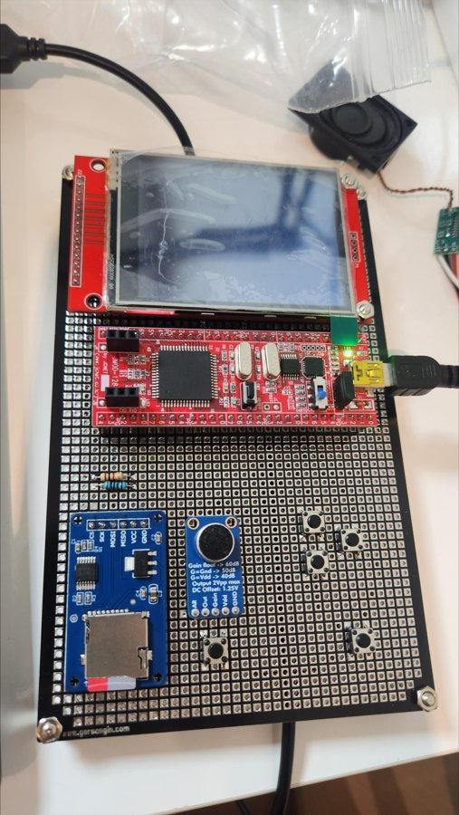
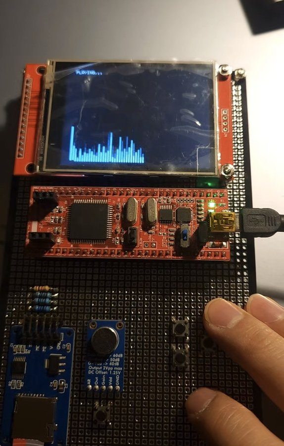
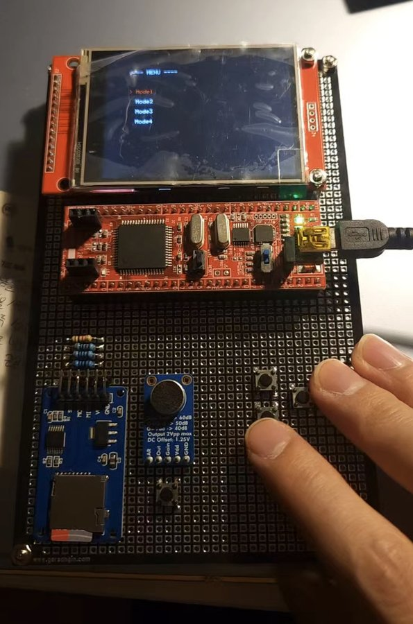
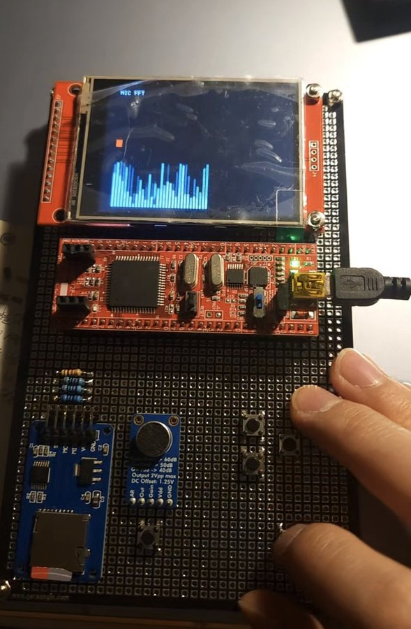
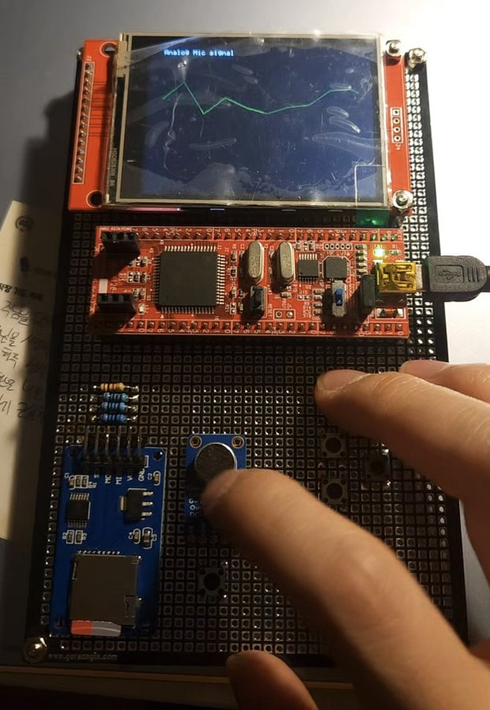
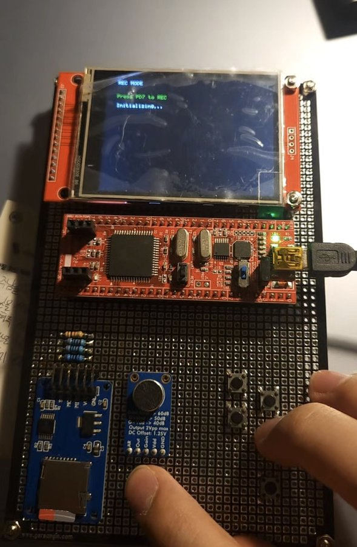
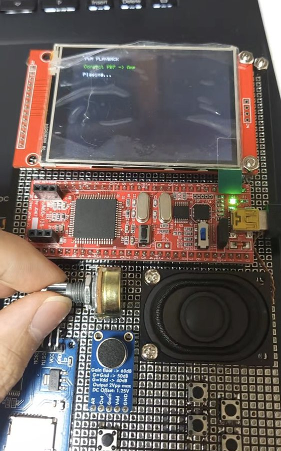
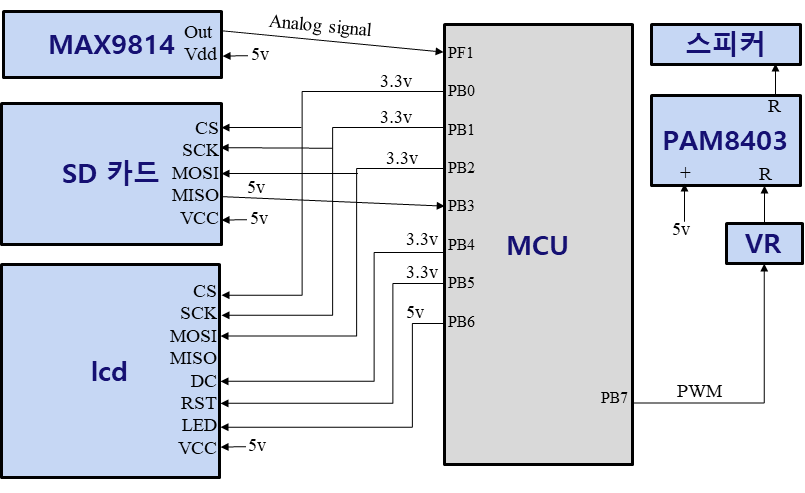
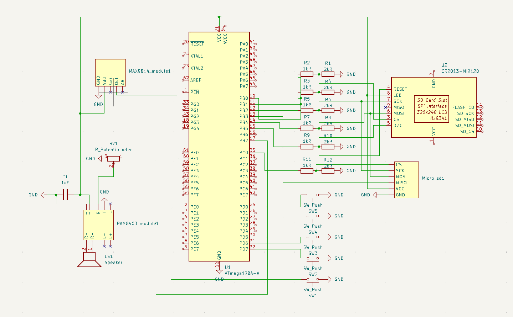
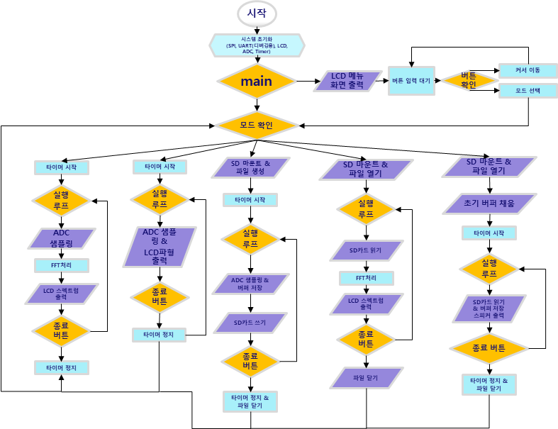

# 🎙️ 스펙트럼 녹음기 (Spectrum Recorder)

ATmega128로 마이크 소리를 녹음해 microSD에 WAV 파일로 저장하고, 저장된 파일을 고정소수점 FFT로 변환해 2.8" TFT LCD에 주파수 스펙트럼으로 보여주는 장치입니다. 녹음한 소리는 PWM으로 스피커 재생도 가능합니다.

> 한성대학교 전자트랙 · 마이크로프로세서 실험 Term Project (6조)
> 김경일, 홍원기

<p align="center">
  
  
</p>

## 주요 기능

외부 인터럽트(INT0) 스위치로 메뉴를 열고, 위/아래/선택 스위치로 모드를 고릅니다.

| 모드 | 기능 |
|---|---|
| Mode 1 | 마이크 입력을 실시간으로 ADC 막대 + FFT 스펙트럼으로 표시 |
| Mode 2 | 마이크 아날로그 파형을 실시간으로 표시 (마이크 동작 확인용) |
| Mode 3 | 녹음 스위치(PD7)로 녹음 시작/정지, `AUDIO.WAV`(8 kHz, 16-bit, mono)로 SD에 저장 |
| Mode 4 | SD의 `AUDIO.WAV`를 읽어 FFT 스펙트럼으로 표시 |
| Mode 5 | SD의 `AUDIO.WAV`를 PWM(PB7, Timer2) → PAM8403 앰프 → 스피커로 재생 |

<p align="center">
  
  
  
  
  
</p>

## 구현 포인트

- **고정소수점 DIT FFT (N=64)**: FPU가 없는 ATmega128에서 속도를 내기 위해 부동소수점 대신 `int8_t` 사인 테이블 기반 고정소수점 연산을 사용
- **부분 갱신 렌더링**: 막대 그래프를 매번 다시 그리지 않고 높이가 변한 부분만 LCD에 갱신해 끊김을 줄임
- **더블 버퍼링**: 128바이트 버퍼 2개를 번갈아 사용해 녹음/재생 중 SD 입출력이 끊기지 않도록 함
- **SPI 버스 공유**: LCD(CS=PB0)와 SD(CS=PC0)가 같은 SPI를 쓰므로 CS와 SPI 클럭을 상황에 맞게 전환 (SD 초기화는 저속, 이후 고속)
- **SDHC 지원**: 32 GB microSD 사용을 위해 `diskio.c`에서 CMD8 / ACMD41(HCS=1) 초기화 구현
- **WAV 헤더 후기록**: 녹음 시작 시 44바이트 공간을 비워두고, 녹음이 끝나면 `f_lseek`로 돌아가 실제 길이로 헤더를 작성

## 하드웨어

| 부품 | 비고 |
|---|---|
| ATmega128A (16 MHz) | 메인 MCU |
| 2.8" SPI TFT LCD (ILI9341) | 320×240, 가로 모드 |
| microSD 모듈 | SPI, 32 GB SDHC |
| MAX9814 | 마이크 앰프 모듈 (처음 쓴 KY-037은 증폭이 약해 교체) |
| PAM8403 + 스피커 | PWM 오디오 출력 |
| 가변저항, 택트 스위치 5개 | 테스트 입력 / 메뉴 조작 |

LCD·SD의 SPI 신호선은 저항 분압(1 kΩ / 2 kΩ)으로 5 V → 3.3 V로 낮춰 연결했습니다.

### 핀 배치

| 핀 | 연결 | 핀 | 연결 |
|---|---|---|---|
| PB0 | LCD CS | PD0 | 메뉴 스위치 (INT0) |
| PB1 | SCK | PD4 | 위 스위치 |
| PB2 | MOSI | PD5 | 아래 스위치 |
| PB3 | MISO | PD6 | 선택 스위치 |
| PB4 | LCD DC | PD7 | 녹음 스위치 |
| PB5 | LCD RST | PF0 | 가변저항 ADC (테스트용) |
| PB6 | LCD LED | PF1 | 마이크 ADC |
| PB7 | PWM 오디오 출력 (OC2) | PC0 | SD CS |
| PG0 | 보드 내장 LED (상태 표시) | PE1 | UART0 TX (디버그, 9600 bps) |

### 블록도 · 회로도 · 흐름도

<p align="center">
  
  
</p>
<p align="center">
  
</p>

## 폴더 구조

```
.
├── src/
│   ├── main.c        # 메인 프로그램 (LCD 드라이버, FFT, 메뉴, 모드 1~5)
│   ├── diskio.c      # FatFs 저수준 I/O: ATmega128 SPI microSD 드라이버
│   └── diskio.h
├── lib/fatfs/        # FatFs R0.16 (ChaN) — ffconf.h 설정 외 원본 그대로
├── docs/images/      # 사진, 회로도, 블록도, 흐름도
├── Makefile
└── LICENSE       # MIT (프로젝트 코드)
```

## 빌드

**avr-gcc (Makefile)**

```bash
make            # build/spectrum_recorder.hex 생성
make flash PROGRAMMER=avrisp2 PORT=usb   # 사용하는 ISP에 맞게 수정
```

**Atmel/Microchip Studio**: GCC C Executable 프로젝트(ATmega128)를 만들고 `src/`와 `lib/fatfs/`의 파일을 모두 추가한 뒤, 두 폴더를 Include 경로에 넣고 링커에 `-lm`을 추가하면 됩니다.

SD 카드는 FAT32로 포맷해서 사용하세요.

## 알려진 이슈 / 개선 여지

- 메뉴 화면에 Mode1~4만 표시되고 커서가 4까지만 이동해서 Mode 5는 메뉴에서 선택되지 않습니다. `draw_menu`/`update_cursor`/`menu_remove`에 Mode5 항목을 추가하고 커서 상한을 5로 바꾸면 됩니다.
- `run_mode()`의 `switch` 안, `case 1:` 앞에 있는 `ILI9341_FillScreen(0x0000);`는 실행되지 않는 코드입니다.
- `font5x7` 테이블이 RAM에 올라가 있어 SRAM 사용량이 약 75%입니다. `PROGMEM` + `pgm_read_byte()`로 옮기면 약 480바이트를 아낄 수 있습니다.
- `disk_ioctl`의 `GET_SECTOR_COUNT`는 고정값(32768)입니다. 현재 `f_mkfs`를 쓰지 않아 동작에는 영향이 없습니다.

## 참고 자료

- [FatFs - Generic FAT Filesystem Module](https://elm-chan.org/fsw/ff/)
- [ILI9341 2.8" SPI Module (LCDwiki)](https://www.lcdwiki.com/2.8inch_SPI_Module_ILI9341_SKU:MSP2807)
- [thefallenidealist/ili9341](https://github.com/thefallenidealist/ili9341)
- 마이크로프로세서 실험 강의 자료

## 라이선스

이 프로젝트의 코드(`src/main.c`, `src/diskio.c`, `Makefile`)와 문서는 [MIT License](LICENSE)를 따릅니다.

`lib/fatfs/`와 `src/diskio.h`는 ChaN의 FatFs 라이선스를 따릅니다([LICENSE.txt](lib/fatfs/LICENSE.txt)).
